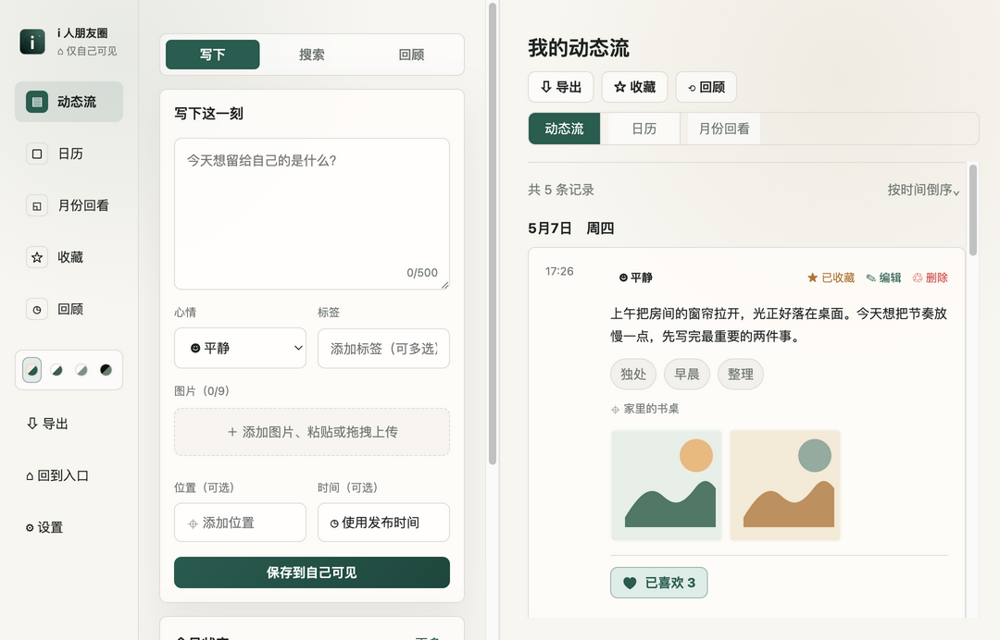
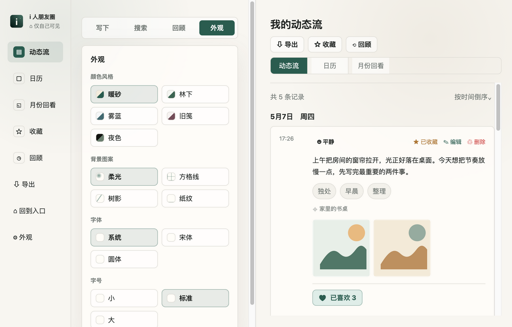
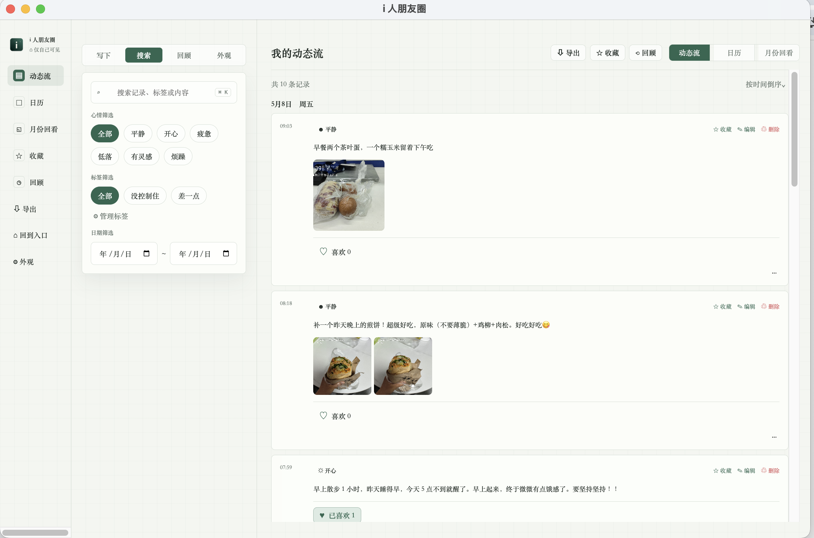
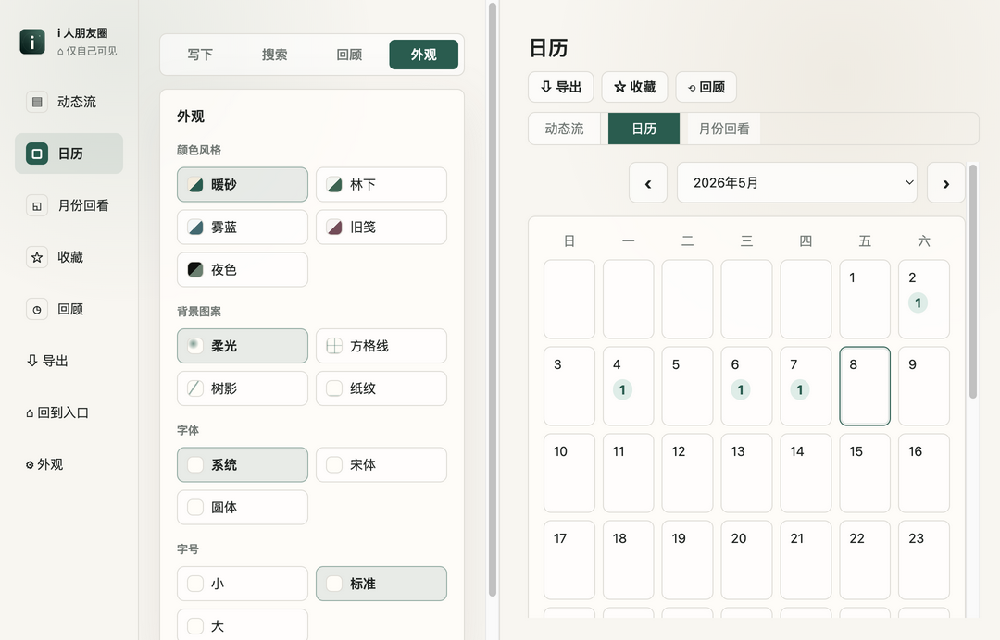

<div align="center">
  
  <h1>i 人朋友圈</h1>
  <p><strong>一个只给自己看的安静角落，用来存放那些不想发出去、但也不想弄丢的日常片刻。</strong></p>
  <p>文字、图片、心情和回看都留在本机，不需要账号，也不需要把它交给任何人。</p>
  <p>
    
    
    
    
  </p>
</div>

---

## 界面概览

<table>
  <tr>
    <td width="50%" align="center">
      <strong>动态流</strong><br>
      <sub>文字、图片、心情和位置都留在一条自己的时间线里。</sub><br><br>
      
    </td>
    <td width="50%" align="center">
      <strong>外观设置</strong><br>
      <sub>颜色、背景图案、字体和字号可以按当天的状态调整。</sub><br><br>
      
    </td>
  </tr>
  <tr>
    <td width="50%" align="center">
      <strong>搜索筛选</strong><br>
      <sub>按关键词、心情、标签和日期，把过去的某一刻找回来。</sub><br><br>
      
    </td>
    <td width="50%" align="center">
      <strong>日历回看</strong><br>
      <sub>用月份和日期回看生活的密度，也能快速跳回当天记录。</sub><br><br>
      
    </td>
  </tr>
</table>

<details>
<summary>入口封面</summary>


</details>

## 功能

- 本地点击进入，不需要账号和密码
- 发布文字、图片、心情、标签和位置
- 支持图片选择、拖拽、复制粘贴和应用内查看
- 动态流、日历视图、月份回看、收藏和回顾
- 点赞、收藏、编辑、删除
- 搜索、心情筛选、标签筛选、日期筛选
- 外观设置：颜色、背景图案、字体和字号
- JSON 导出

## 本地数据

内容和图片都保存在本机应用数据目录，不依赖网络服务。图片会统一复制到应用私有目录，原始文件移动或删除后，已保存日志中的图片仍可查看。

## 开发运行

```bash
npm install
npm start
```

## 测试

```bash
npm test
npm run smoke
```

## 打包 macOS App

```bash
npm run package:mac
```

打包结果会生成在：

```text
release/i 人朋友圈-darwin-arm64/i 人朋友圈.app
```

## 目录

```text
assets/              应用图标资源
docs/images/         README 界面截图
scripts/             图标生成、截图生成与冒烟测试脚本
src/main/            Electron 主进程与本地存储
src/renderer/        前端界面
src/shared/          共享常量
tests/               存储层测试
```
